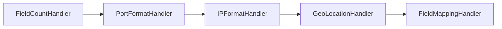

在我的工作中，数据处理占据了比较大的权重。在数据处理的过程中，有一项比较繁琐的工作，就是对日志中的每个字段进行单独校验和处理，校验的内容分别有一下几类：

- 字段数量校验
- 字段为空判断
- 字段内容校验
- 特殊字段校验、信息补充
- 增加标签字段

<!-- more -->

在这类场景中，最常规的方法就是编写冗长的 `if-else` 代码段进行按部就班的校验，这显然不是最佳方案。

责任链模式可以有效地解决上述繁琐的工作。通过将不同的校验和处理逻辑分配给不同的处理者，形成一条责任链，数据依次通过各个处理者进行处理。这样做的好处是：

1. 避免编写大量的重复 `if-else` 代码
2. 将每个校验逻辑进行隔离，区分责任边界
3. 逻辑清晰，代码简洁

以下是一个简单的责任链模式代码示例：

```java
public class ChainHandler {
    private List<Handler> handlers;

    public ChainHandler() {
        this.handlers = new ArrayList<>();
    }

    public void addHandler(Handler handler) {
        handlers.add(handler);
    }

    public boolean handle(LogEntry logEntry) {
        for (Handler handler : handlers) {
            handler.handle(logEntry);
            if (!handler.isComplete()) {
                return false; // 如果处理程序未完成，则整个处理链失败
            }
        }
        return true; // 如果所有处理程序均完成，则整个处理链成功
    }
}

// 定义责任链接口
public interface Handler {
    boolean isComplete();
    void handle(LogEntry logEntry);
}

// 字段数量校验
public class FieldCountHandler implements Handler {
    @Override
    public boolean isComplete() {
        // 检查字段数量是否满足要求
        return true; 
    }

    @Override
    public void handle(LogEntry logEntry) {
        // 进行字段数量的校验和处理
    }
}
```

在上述代码中，`ChainHandler` 类管理责任链中的处理者。`FieldCountHandler` 和 `FieldContentHandler` 分别是处理字段数量和字段内容的处理者实现。

通过这种方式，我们只需要编写最基础的 handler 即可完成大量的校验。各个 handler 之间互相隔离，最终的伪代码如下：

```java
public class LogEntry {
    // 假设这是日志条目的类定义，包含各个字段
    ... 内容省略
}

public class Main {
    public static void main(String[] args) {
        List<LogEntry> logEntrys = getLogEntries();
		
        // 创建处理程序对象并添加到处理链中
        ChainHandler chainHandler = new ChainHandler(); // 构造责任链
        chainHandler.addHandler(new FieldCountHandler()); // 字段数量校验
        chainHandler.addHandler(new PortFormatHandler()); // 端口校验
        chainHandler.addHandler(new IPFormatHandler()); // IP 校验
        chainHandler.addHandler(new GeoLocationHandler()); // IP 地理位置信息填充
        chainHandler.addHandler(new FieldMappingHandler()); // 字段映射
        
		// 遍历日志条目列表并执行处理 
		for (LogEntry logEntry : logEntrys) { 
			boolean success = chainHandler.handle(logEntry); 
			// 根据处理结果输出相应信息 
			if (success) { 
				System.out.println("日志校验成功"); 
			} else { 
				System.out.println("日志校验失败"); 
			} 
		}
    }
}

// 举例1，其他样例请自行填充
public class PortFormatHandler implements Handler {
    @Override
    public boolean isComplete() {
        // 检查字段1是否符合端口格式
        // 假设端口格式合法的条件是字段1为数字且在0到65535之间
        return true; 
    }
    @Override
    public void handle(LogEntry logEntry) {
        // 进行字段1端口格式的校验和处理
    }
}
```

以上代码执行流程如图：




以上便是责任链模式在数据处理过程中一些简单的应用，当然在实际工作中可能还会遇到一些其他的挑战，比如：

1. 在责任链中需要传递上下文信息
2. 责任链之间需要有依赖关系
3. 提高责任链的执行效率

以上等等都是当前举例的责任链所不具备的功能，总之，所谓的设计模式都是为业务服务的，是一些经过前人总结出来的固定套路，但是随着业务需求的变化，套路也需要学会进化。


